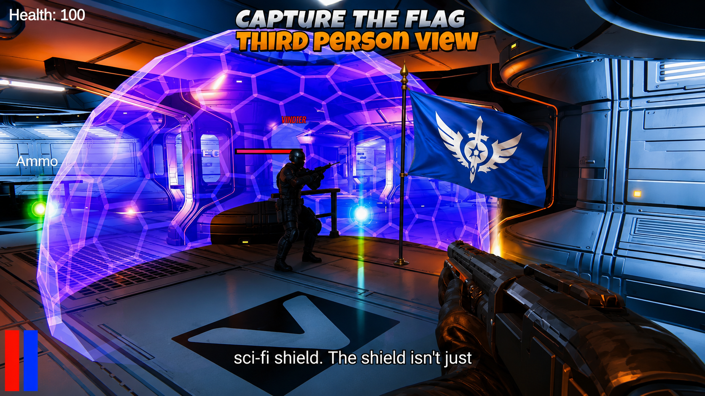

# Blitzone Warfare

A multiplayer FPS Capture The Flag game built with Unity and Mirror Networking.

## Portfolio

Full project breakdown, technical details, screenshots, and development information:

https://kaushal-portfolio-liart.vercel.app/Projects/MultiplayerCTF

## Repository Contents

This repository contains the **C# scripts and programming systems** used to build Blitzone Warfare.

The complete Unity project is not included because the game contains a large number of assets, builds, and other files, making the full project too large for this repository.

The repository is focused on showcasing the game's **programming, gameplay, and multiplayer networking systems**.

## Gameplay Demo

### YouTube Gameplay Demo

https://youtu.be/9sCAUyiXATg?si=M80l7BT4tphuSBNR

## Key Systems

- Multiplayer networking using Mirror
- Dedicated server architecture
- 4v4 Capture The Flag gameplay
- Player health, damage, death, and respawn systems
- Multiplayer player synchronization
- Weapon and shooting systems
- Character selection and lobby systems
- Team-based gameplay
- Kill/death tracking
- Flag pickup and capture systems
- AI bots
- Player UI and HUD systems

## Technologies

- Unity
- C#
- Mirror Networking
- Unity NavMesh
- Firebase

## Note

This repository is primarily intended to showcase the **programming and gameplay systems** behind Blitzone Warfare rather than serve as a complete downloadable Unity project.
